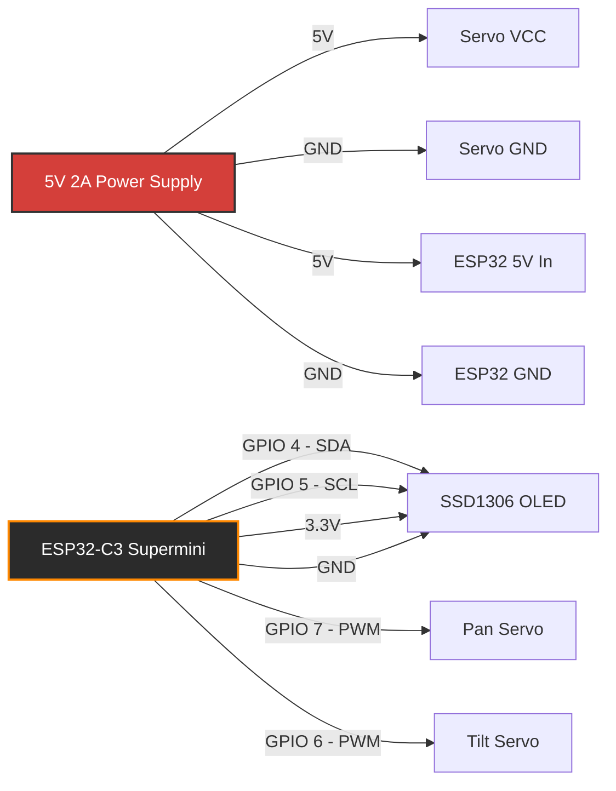
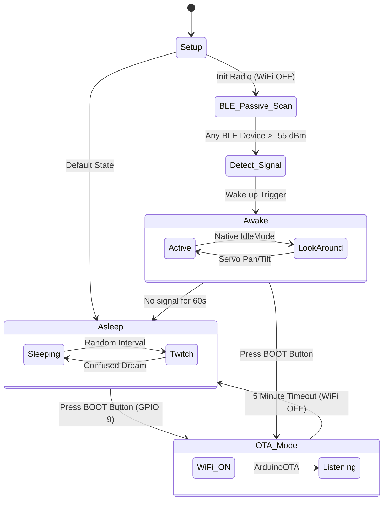

# 🤖 Era DeskBot - The ESP32-C3 Smart Desk Companion


Meet **Era DeskBot**, a tiny, expressive, and zero-setup smart desk companion built on the **ESP32-C3 Supermini**. Era watches you work, gets bored when you ignore it, tracks your physical presence using invisible BLE fields, and judges your code silently.

> **Keywords:** `ESP32-C3 Supermini`, `Desk Companion Robot`, `Desktop Robot`, `Arduino`, `PlatformIO`, `BLE Proximity Detection`, `Servo Robot Eyes`, `OLED SSD1306 Robot`, `Open Source Robot`, `DIY AI Assistant Hardware`

---

## ⚡ Key Features

- **Zero-Setup BLE Proximity Detection:** Era automatically detects when you sit at your desk by passively scanning for the raw BLE signals emitted by your iPhone, Apple Watch, or AirPods. No apps, no pairing, no hardcoded MAC addresses. Just walk up, and it wakes up.
- **Physical Pomodoro Timer (Touch Sensor):** Tap a capacitive touch sensor (GPIO 10) to instantly transform Era into a focus timer. The robot halts its animations, stares straight ahead, and displays a crisp Pomodoro UI on its OLED. Tap to add 5 minutes, hold to start/pause. When the timer hits zero, the bot physically shakes its head to alert you.
- **Expressive OLED Eyes:** Uses the `FluxGarage RoboEyes` library for smooth, animated expressions (blinking, tiredness, confusion).
- **On-Demand OTA Updates (No Stutter):** To prevent radio bottlenecks, Wi-Fi stays physically powered off. Pressing the physical BOOT button (GPIO 9) kills the BLE scanner to give 100% of the radio to Wi-Fi for exactly 5 minutes. The bot continues to animate and look around normally while listening for an Over-The-Air firmware flash. After 5 minutes, it kills the Wi-Fi and reboots the BLE scanner to restore maximum performance.
- **Smooth 2-Axis Motion:** Pan and tilt tracking using dual servos with built-in software easing for fluid movements.
- **State Machine Architecture:** Non-blocking `millis()` based loops and hardware Watchdog protection.

---

## 🛠️ Hardware Requirements

- **Microcontroller:** ESP32-C3 Supermini
- **Display:** 0.96" I2C OLED Display (SSD1306)
- **Actuators:** 2x Micro Servos (Pan and Tilt). *Upgrading to MG90S metal-gear servos is highly recommended over standard SG90s!*
- **Power (CRITICAL):** Do NOT power the servos directly from the ESP32 3.3V/5V rails. Use a dedicated 5V buck converter (>= 2A) and tie the grounds together.

---

## 📌 Circuit Diagram & Wiring



---

## 🧠 Logic Flowchart



---

## 📦 Required Libraries
If you're using PlatformIO, these are automatically installed via `platformio.ini`. If you're using the standard **Arduino IDE**, install these via the Library Manager:
- `Adafruit GFX Library` by Adafruit
- `Adafruit SSD1306` by Adafruit
- `ESP32Servo` by Kevin Harrington
- `FluxGarage RoboEyes` by FluxGarage
- `NimBLE-Arduino` by h2zero

---

## 🚀 Getting Started

This project is natively configured for **PlatformIO**.

1. Clone the repository:
   ```bash
   git clone https://github.com/devakshay07/EraDeskBot.git
   cd EraDeskBot
   ```
2. *(Optional)* Update `ssid` and `password` in `src/main.cpp` to enable OTA updates. Leave default to run offline perfectly.
3. Open the folder in VSCode with the PlatformIO extension installed.
4. Build and Upload to your ESP32-C3 Supermini.

---

## 🙏 Credits & Open Source
Massive thanks to:
- [FluxGarage/RoboEyes](https://github.com/FluxGarage/RoboEyes) 
- [Adafruit GFX](https://github.com/adafruit/Adafruit-GFX-Library) 
- [NimBLE-Arduino](https://github.com/h2zero/NimBLE-Arduino)
- [ESP32Servo](https://github.com/madhephaestus/ESP32Servo) 

## 📜 License
Licensed under the **MIT License**. See `LICENSE` for details.
